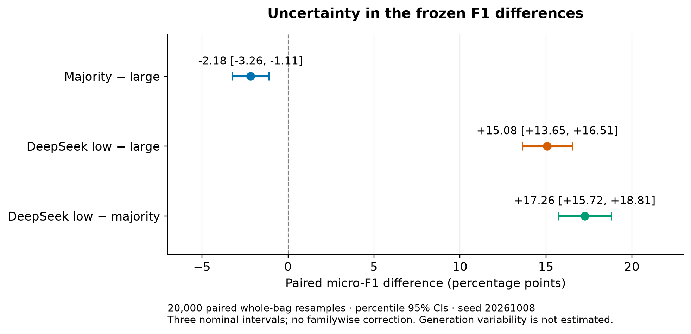
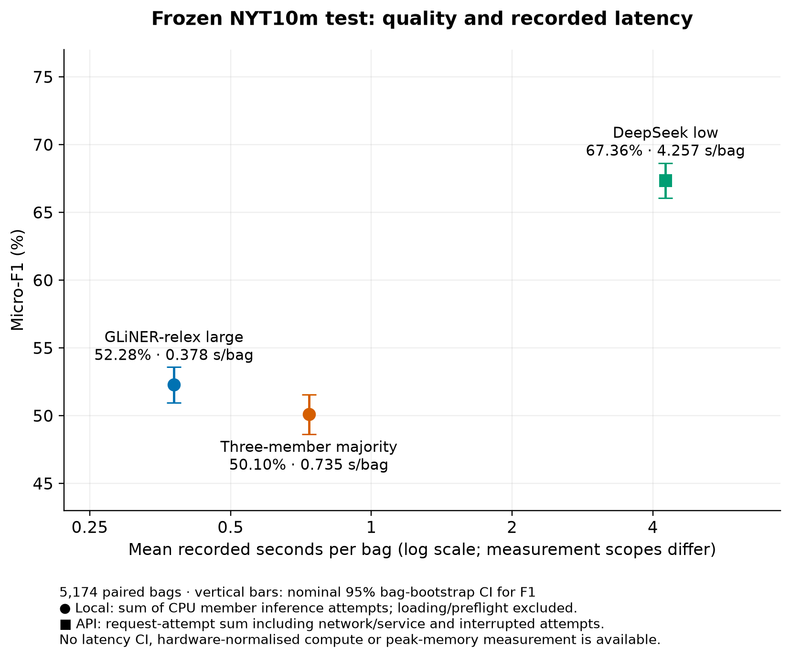
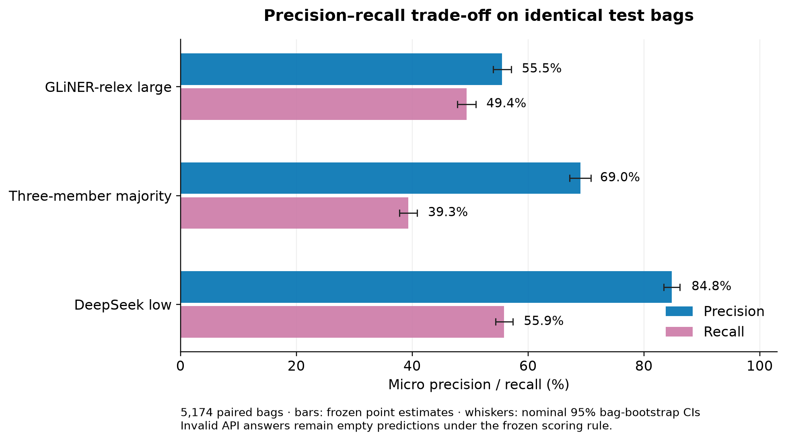

# Frozen test comparison: uncertainty, voting errors and costs

Completed 8 October 2026 using saved predictions only. No new API requests, model inference, threshold selection or reference changes occurred. The [analysis notebook](../source/Test_results_analysis.ipynb) displays all tables, examples and figures without data or checkpoints. The [statistical report](../results/test_statistical_analysis_20261008.json) and [11 KB count archive](../results/test_bag_counts_20261008.npz) preserve the numerical analysis.

## Paired uncertainty analysis

The same 5,174 official manual-test bags are resampled with replacement for all three frozen systems, keeping each bag's complete label set together. For each of 20,000 replicates, seed `20261008`, micro-F1 is recomputed from summed TP/FP/FN. Neither sentences nor individual labels are resampled; bag-level F1 values are not averaged. Negative bags and invalid API responses remain included. The count archive stores sufficient statistics for this paired analysis without texts, names or entity IDs.

| Frozen contrast | Micro-F1 difference (percentage points) | Paired 95% percentile CI |
|---|---:|---:|
| Majority − large | −2.18 | [−3.26, −1.11] |
| DeepSeek low − large | +15.08 | [+13.65, +16.51] |
| DeepSeek low − majority | +17.26 | [+15.72, +18.81] |

All three intervals exclude zero. These are nominal intervals without familywise multiplicity adjustment. They quantify sampled-bag uncertainty conditional on fixed predictions, references and configurations; they do not measure repeated API-generation variation, annotation uncertainty, training variation or configuration-search uncertainty. Approximate bag exchangeability is assumed; shared entities or articles may create dependencies not represented by this ordinary bootstrap. Descriptive relation-level results below have no class-specific intervals.

## Quality and latency

| Frozen system | Precision | Recall | Micro-F1 [95% CI] | Mean recorded seconds/bag |
|---|---:|---:|---:|---:|
| GLiNER-relex large0.7 | 55.52% | 49.40% | 52.28% [50.96, 53.59] | 0.378 |
| Majority base0.5 / large0.7 / GLiDRE0.7 | 69.02% | 39.32% | 50.10% [48.62, 51.57] | 0.735 |
| DeepSeek thinking-low | 84.81% | 55.86% | 67.36% [66.07, 68.64] | 4.257 |

The ensemble has lower micro-F1 and requires 1.94× large's local inference time. The paired interval supports the observed deficit within the bootstrap assumptions. This is evidence against the tested majority at the primary F1/time objective; it is not evidence against every possible ensemble. Its improved precision could matter under another explicitly defined error-cost objective, which is not evaluated here.

DeepSeek has higher measured precision, recall and F1. Its request-attempt time is 11.25× large's CPU inference sum, but these have different measurement scopes and do not establish an intrinsic compute-speed ratio. The 78 invalid/truncated completions remain failures under the frozen rule.

## Lost and recovered relations

Relative to large, voting changes 1,200 bags. It removes 468 correct facts and 897 false positives, while adding 75 correct facts and 42 false positives. Net: 393 fewer TP and 855 fewer FP. A label accepted only by large is removed because neither other member supports it. A correct label absent from large is recovered only when base and GLiDRE both accept it.

| Relation | Correct facts lost | Correct facts recovered | Net TP | FP removed | FP added |
|---|---:|---:|---:|---:|---:|
| Location contains | 276 | 2 | −274 | 145 | 0 |
| Country administrative divisions | 89 | 0 | −89 | 181 | 0 |
| Person/company | 3 | 30 | +27 | 5 | 1 |
| Place of death | 2 | 17 | +15 | 18 | 1 |
| Place lived | 12 | 16 | +4 | 14 | 2 |
| Children | 12 | 1 | −11 | 3 | 0 |
| Nationality | 17 | 2 | −15 | 26 | 13 |

Containment and country administrative divisions account for 365/468 rejected correct facts (78.0%). Person/company, place of death and place lived account for 63/75 recoveries (84.0%). The improvement in selected relation types does not offset the containment-related recall loss overall.

Two deterministic single-sentence examples illustrate the mechanism. For **Atlanta → Sweet Auburn**, the sentence identifies “the Sweet Auburn neighborhood in Atlanta”; the official relation is `contains`. Large accepts it; base and GLiDRE return empty sets, so majority loses a correct relation. For **David Brooks → The New York Times**, the sentence explicitly identifies Brooks as “a columnist for The New York Times”. Large returns an empty set; base and GLiDRE agree on `person/company`, recovering the official relation. Complete selected sentences and accepted labels are available in the notebook and JSON. These are diagnostic illustrations, not additional adjudication or method-selection evidence.

## Separate cost dimensions

| Dimension | Large | Majority | DeepSeek low |
|---|---:|---:|---:|
| Local CPU inference-attempt sum | 1,957.52 s / 32.63 min | 3,803.89 s / 63.40 min | Not applicable |
| API request-attempt sum | Not applicable | Not applicable | 22,023.95 s / 6.12 h |
| Reconstructed API charge | Not applicable | Not applicable | USD 2.40966831 |
| Unknown-charge reserve | Not applicable | Not applicable | USD 0.01210260 |
| Peak local runtime memory | Not measured | Not measured | Provider memory unavailable |

Local timing includes all required member inference attempts and session label encoding, excluding loading and preflight. API timing includes network/service and the two interrupted attempts, excluding idle gaps and backoff; it is not elapsed start-to-finish time. API usage plus reserve is USD 2.42177091; the reserve is not a known charge and reconstructed expenditure is not an invoice. Local monetary and energy costs were not measured. Missing memory is recorded as `null`, not zero; checkpoint size is not substituted for peak memory. No combined quality-per-dollar or memory-efficiency claim is made.

## Reproduction and checks

The new analysis is separate from the nine hash-bound inference sources. It validates the frozen specification, inputs, references, all 15,522 encoder caches, 5,174 API responses, response journals, primary counts, timing and transition diagnostics. A 25,878-file saved-input/cache/journal inventory hash is recorded. The published report's point estimates match the earlier summaries exactly.

[analyze_test_results.py](../source/analyze_test_results.py) exports the compact counts and bootstrap report. [plot_test_results.py](../source/plot_test_results.py) exports PNG, SVG and PDF figures with a hash manifest. The notebook defaults to viewing the saved report; optional flags recompute statistics or figures without model execution. Figure regeneration dependencies were installed only in an isolated temporary Python environment, leaving the project environment unchanged. Synthetic tests verify paired indices, whole-bag multilabel contributions, micro aggregation, invalid/negative inclusion, identical-system zero differences and mismatched-support rejection.
